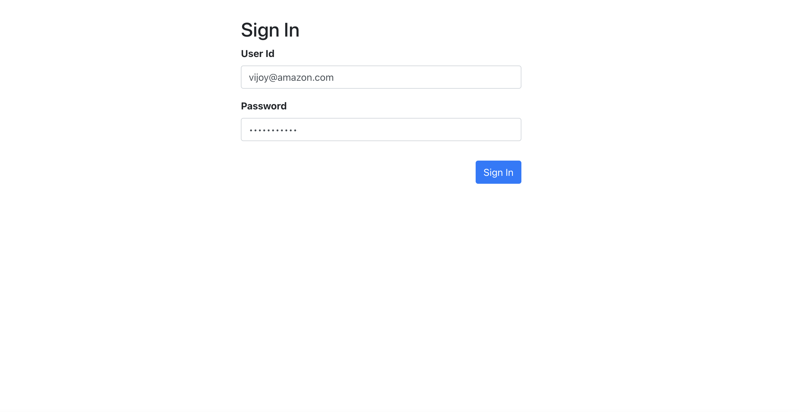
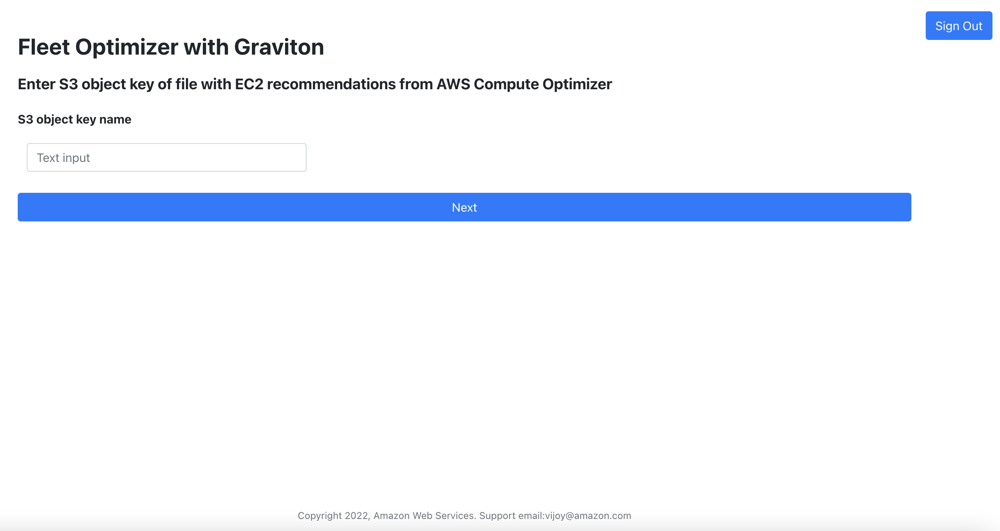
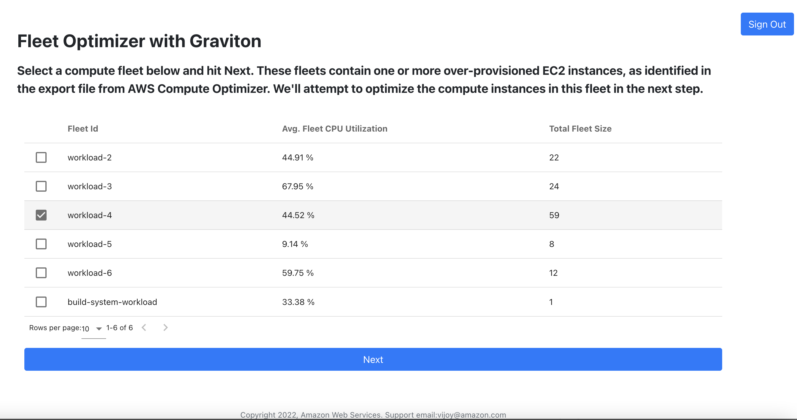
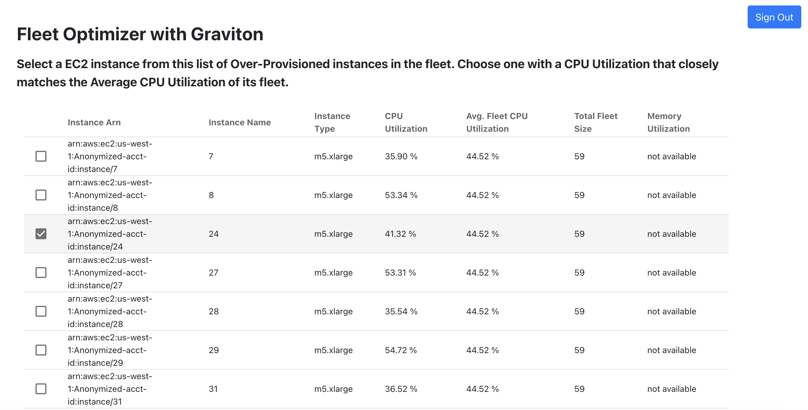
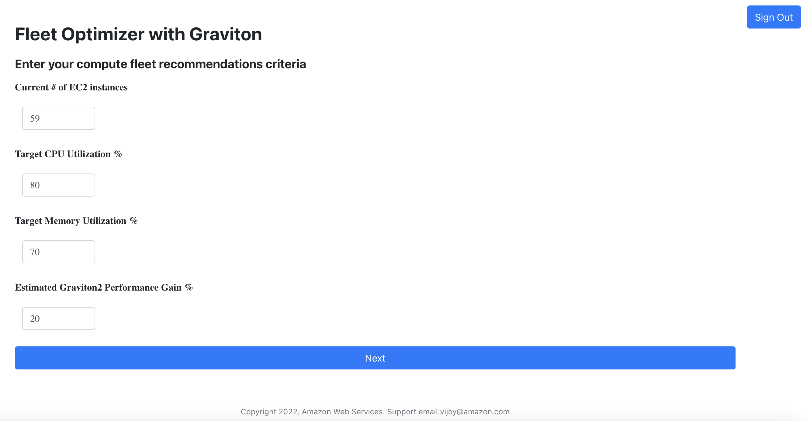
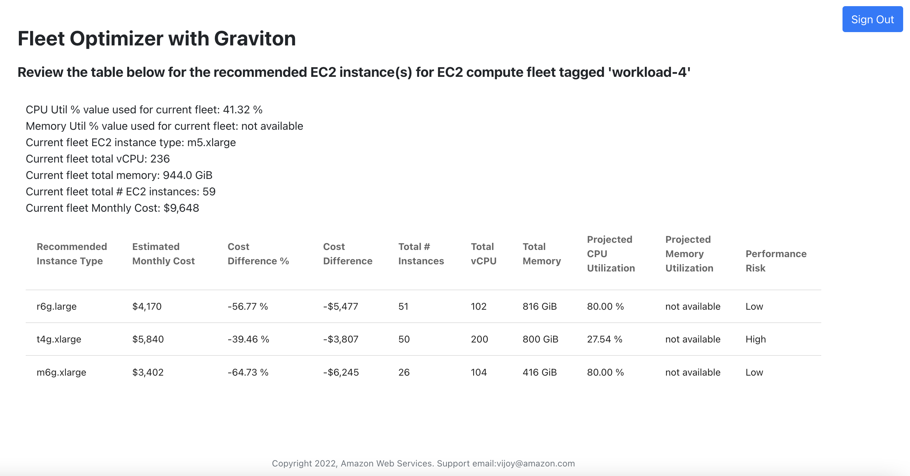

# Fleet Optimizer with Graviton

In this workshop you'll learn how to launch the Fleet Optimizer with Graviton tool in your AWS environment.

## Pre-requisites

The following need to be installed on the machine where you plan to execute the below setup commands:
  Node.js, NPM, Python 3.9 or higher, AWS CLI

## Installing Amplify CLI and Vue CLI

```bash
$ npm install -g @aws-amplify/cli
$ npm install -g @vue/cli-service
```

## Download the code repo and initialize a Amplify project 

### Clone the tool repo to your a local directory and download the package dependencies

Identify a folder on your local machine from where you plan to run this tool. We'll call this the install directory ie., 'install-dir' for the rest of this document.

Now change into this 'install-dir' and clone the amazon-ec2-compute-fleet-optimizer repo. 

```bash
$ git clone https://github.com/aws-samples/amazon-ec2-compute-fleet-optimizer
```

Now change into the 'frontend' folder within your newly created folder ```<install-dir>/amazon-ec2-compute-fleet-optimizer```. We'll call this 'frontend' folder the project directory ie., 'project-dir' for the rest of this document. 

Run below command to download the package dependencies of the project in the project directory.

```bash
$ npm install
```

### Initializing a new AWS Amplify Project in the codebase

For this we begin with configuring the Amplify CLI with our credentials.

```bash
$ amplify configure

Follow these steps:

Sign in to your AWS administrator account:
https://console.aws.amazon.com/
Press Enter to continue

Specify the AWS Region
? region:  <aws-region>
Specify the username of the new IAM user:
? user name: <IAM-USER-NAME>
Complete the user creation using the AWS console

Press Enter to continue
```

In the AWS Console, click Next: Permissions, Next: Tags, Next: Review, & Create User to create the new IAM user. 
Make sure to note the 'Secret access key' and 'Access key ID' values before leaving this screen. 
Then return to the command line & press Enter.

```bash
Enter the access key of the newly created user:
? accessKeyId:  <YOUR-USER-ACCESS-KEY-ID>
? secretAccessKey:  <YOUR-USER-SECRET-ACCESS-KEY>
This would update/create the AWS Profile in your local machine
? Profile Name: <YOUR-AMPLIFY-CLI-USER-PROFILE-NAME>
```

Ensure you are in the project directory when running the below command to initialize a new Amplify project:

```bash
$ amplify init

Follow these steps:

? Enter a name for the project: <YOUR-AMPLIFY-APP-PROJECT-NAME>
The following configuration will be applied:

Project information
| Name: <YOUR-AMPLIFY-APP-PROJECT-NAME>
| Environment: dev
| Default editor: Visual Studio Code
| App type: javascript
| Javascript framework: vue
| Source Directory Path: src
| Distribution Directory Path: dist
| Build Command: npm run-script build
| Start Command: npm run-script serve

? Initialize the project with the above configuration? (Y/n) y
Using default provider  awscloudformation
? Select the authentication method you want to use: AWS profile

For more information on AWS Profiles, see:
https://docs.aws.amazon.com/cli/latest/userguide/cli-configure-profiles.html

```

Make sure to select the profile name entered in the previous step.

```bash
? Please choose the profile you want to use: 
  default 
❯ <YOUR-AMPLIFY-CLI-USER-PROFILE-NAME>

```

**NOTE: Please make a note of the Amplify App project name you entered above** i.e., ```<YOUR-AMPLIFY-APP-PROJECT-NAME>```

The Amplify CLI has initialized a new project & you will see a new folder: __amplify__ & a new file called __aws-exports.js__ in the 'src' folder within the project directory. These files hold your project configuration.


## Adding Authentication

Run the below command to add authentication to our Amplify app:

```bash
$ amplify add auth

Follow these steps:

Using service: Cognito, provided by: awscloudformation
 
 The current configured provider is Amazon Cognito. 
 
? Do you want to use the default authentication and security configuration? Manual configuration
? Select the authentication/authorization services that you want to use: User Sign-Up, Sign-In, connected with AWS IAM controls (Enab
les per-user Storage features for images or other content, Analytics, and more)
? Provide a friendly name for your resource that will be used to label this category in the project: <YOUR-AUTH-CATEGORY-NAME>
? Enter a name for your identity pool: <YOUR-ID-POOL-NAME>
? Allow unauthenticated logins? (Provides scoped down permissions that you can control via AWS IAM) No
? Do you want to enable 3rd party authentication providers in your identity pool? No
? Provide a name for your user pool: <YOUR-USER-POOL-NAME>
  Warning: you will not be able to edit these selections. 
? How do you want users to be able to sign in: Email
? Do you want to add User Pool Groups? Yes
? Provide a name for your user pool group: computeToolsUPG
? Do you want to add another User Pool Group? No
✔ Sort the user pool groups in order of preference: computeToolsUPG
? Do you want to add an admin queries API? No
? Multifactor authentication (MFA) user login options: OFF
? Email based user registration/forgot password: Disabled (Uses SMS/TOTP as an alternative)
? Please specify an SMS verification message: Your verification code is {####}
? Do you want to override the default password policy for this User Pool? No
  Warning: you will not be able to edit these selections. 
? What attributes are required for signing up: Email, Name
? Specify the apps refresh token expiration period (in days): 30
? Do you want to specify the user attributes this app can read and write? No
? Do you want to enable any of the following capabilities? 
? Do you want to use an OAuth flow? No
? Do you want to configure Lambda Triggers for Cognito? (Y/n) n

```

## Adding Storage

Run the below command to add storage to our Amplify app:

```bash
$ amplify add storage

Follow these steps:

? Select from one of the below mentioned services: Content (Images, audio, video, etc.)
? Provide a friendly name for your resource that will be used to label this category in the project: <YOUR-STORAGE-CATEGORY-NAME>
? Provide bucket name: <YOUR-BUCKET-NAME>
? Restrict access by: Individual Groups
? Select groups: computeToolsUPG
? What kind of access do you want for computeToolsUPG users: read
? Do you want to add a Lambda Trigger for your S3 Bucket? (y/N) no
```

## Adding a Lambda function

Run the below command to add a Lambda function to our Amplify app:

**NOTE:** _Make sure to enter S3_BUCKET_ENV_VAR_NAME verbatim when it prompts you for the environment variable name to pass to this lambda function. Similarly, for its value, enter this text ``` STORAGE_<YOUR-STORAGE-CATEGORY-NAME>_BUCKETNAME ``` after substituting the portion within angle bracket with the storage category name you chose in the previous step. Failing to do so will end up in errors when you eventually use the tool._

```bash
$ amplify add function

Follow these steps:

? Select which capability you want to add: Lambda function (serverless function)
? Provide an AWS Lambda function name: <YOUR-FUNCTION-CATEGORY-NAME>
? Choose the runtime that you want to use: Python
Only one template found - using Hello World by default.

Available advanced settings:
- Resource access permissions
- Scheduled recurring invocation
- Lambda layers configuration
- Environment variables configuration
- Secret values configuration

? Do you want to configure advanced settings? Yes
? Do you want to access other resources in this project from your Lambda function? Yes
? Select the categories you want this function to have access to: storage
? Select the operations you want to permit on <YOUR-STORAGE-CATEGORY-NAME> : read

You can access the following resource attributes as environment variables from your Lambda function
	ENV
	REGION
	STORAGE_<YOUR-STORAGE-CATEGORY-NAME>_BUCKETNAME
? Do you want to invoke this function on a recurring schedule? No
? Do you want to enable Lambda layers for this function? No
? Do you want to configure environment variables for this function? Yes
? Enter the environment variable name: S3_BUCKET_ENV_VAR_NAME
? Enter the environment variable value: STORAGE_<YOUR-STORAGE-CATEGORY-NAME>_BUCKETNAME
? Select what you want to do with environment variables: I am done

You can access the following resource attributes as environment variables from your Lambda function
	ENV
	REGION
	STORAGE_<YOUR-STORAGE-CATEGORY-NAME>_BUCKETNAME
	S3_BUCKET_ENV_VAR_NAME
? Do you want to configure secret values this function can access? No
? Do you want to edit the local lambda function now? (Y/n) n

```

### Copy the source code for the lambda function 

Execute the below copy command to copy the lambda function code from the repo you cloned to the folder created in above step. Look for the output that looks like this in the console output from running the previous step. 
"Next steps:
Check out sample function code generated in ```<project-dir>/amplify/backend/function/<YOUR-FUNCTION-CATEGORY-NAME>/src```

```bash
$ cp <install-dir>/backend/function/*  <project-dir>/amplify/backend/function/<YOUR-FUNCTION-CATEGORY-NAME>/src/
```

## Adding a REST API

Run the below command to add a REST API to our Amplify app::

```bash
$ amplify add api

Follow these steps:

? Select from one of the below mentioned services: REST
? Provide a friendly name for your resource to be used as a label for this category in the project: <YOUR-API-CATEGORY-NAME>
? Provide a path (e.g., /book/{isbn}): /price-performance-optimize 
```
**NOTE**: _For the path, make sure to enter /price-performance-optimize _

```bash
? Choose a Lambda source: Use a Lambda function already added in the current Amplify project
  Only one option for [Choose the Lambda function to invoke by this path]. Selecting [<YOUR-FUNCTION-CATEGORY-NAME>].
? Restrict API access? (Y/n) yes
? Restrict access by: Individual Groups
  Must pick at least 1 of 1 options. Selecting all options [computeToolsUPG]
? What permissions do you want to grant to computeToolsUPG users: create, read, update
? Do you want to add another path? (y/N) no
```

## Adding Hosting

To deploy & host your app on AWS, we add the `hosting` category to our Amplify app.

```bash
$ amplify add hosting

Follow these steps:

? Select the plugin module to execute Hosting with Amplify Console: (Managed hosting with custom domains, Continuous deployment)
? Choose a type: Manual deployment
```

Now, everything is set up & we can publish it:

```bash
$ amplify publish

✔ Successfully pulled backend environment dev from the cloud.

    Current Environment: dev
    
┌──────────┬─────────────────────────────────┬───────────┬───────────────────┐
│ Category │ Resource name                   │ Operation │ Provider plugin   │
├──────────┼─────────────────────────────────┼───────────┼───────────────────┤
│ Auth     │ userPoolGroups                  │ Create    │ awscloudformation │
├──────────┼─────────────────────────────────┼───────────┼───────────────────┤
│ Auth     │ <YOUR-AUTH-CATEGORY-NAME>       │ Create    │ awscloudformation │
├──────────┼─────────────────────────────────┼───────────┼───────────────────┤
│ Storage  │ <YOUR-STORAGE-CATEGORY-NAME>    │ Create    │ awscloudformation │
├──────────┼─────────────────────────────────┼───────────┼───────────────────┤
│ Function │ <YOUR-FUNCTION-CATEGORY-NAME>   │ Create    │ awscloudformation │
├──────────┼─────────────────────────────────┼───────────┼───────────────────┤
│ Api      │ <YOUR-API-CATEGORY-NAME>        │ Create    │ awscloudformation │
├──────────┼─────────────────────────────────┼───────────┼───────────────────┤
│ Hosting  │ amplifyhosting                  │ Create    │ awscloudformation │
└──────────┴─────────────────────────────────┴───────────┴───────────────────┘
? Are you sure you want to continue? Yes
...
...
...

 DONE  Build complete. The dist directory is ready to be deployed.
 INFO  Check out deployment instructions at https://cli.vuejs.org/guide/deployment.html
      
✔ Zipping artifacts completed.
✔ Deployment complete!
https://dev.<YOUR-AMPLIFY-APP-PROJECT-NAME>.amplifyapp.com

```

NOTE: After the publish, note down the tool's URL displayed at the tail end of the publish output. This is shown above. You'll need this to launch your webapp in the browser later.


## Getting ready to launch the tool

### Sign-up end-user to use the tool

To setup a user, we'll start by signing up a user to the user pool created earlier. 

You will need to lookup the value for the 'awsmobile.aws_user_pools_web_client_id' from the aws-exports.js file located in ```<project-dir>/src/aws-exports.js``` and provide it as value for the command parameter 'client-id'.

```bash
$ aws cognito-idp sign-up \
--username <user-email-id> \
--user-attributes '[{"Name": "email","Value": "<user-email-id>"},{"Name": "name","Value": "<user-full-name>"}]' \
--client-id <YOUR-WEB-CLIENT-ID> --password <a-user-password>


{
    "UserConfirmed": false,
    "UserSub": <YOUR-USER-SUB>
}
```

Note down the 'UserSub' value from the json output.

Next, let's confirm the sign-up for this user by running the below command. You'll need to grab the value for the field 'awsmobile.aws_user_pools_id' from the aws-exports.js file and the value of the above mentioned 'UserSub' field to provide to the 'user-pool-id' and 'username' command parameters respectively.

```bash
$ aws cognito-idp admin-confirm-sign-up \
--user-pool-id <YOUR-USER-POOL-ID> --username <YOUR-USER-SUB>
```

Let's assign the newly created user to the user group 'computeToolsUPG' we provisioned in the above setup

```bash
$ aws cognito-idp admin-add-user-to-group --user-pool-id <YOUR-USER-POOL-ID> --username <YOUR-USER-SUB> --group-name computeToolsUPG
```

### Upload a AWS Compute Optimizer generated CSV file to the S3 bucket

You'll need to a CSV report generated from AWS Compute Optimizer with its recommendations for EC2 instance type. Make sure to have selected the CPU architecture preference as 'Graviton (aws-arm64)' prior to generating the recommendation report from Compute Optimizer.

Once you have the CSV file, proceed to the next step to launch the amplify console.

```bash
$ amplify console
✔ Which site do you want to open? · AWS console
```

In the console, navigate to 'File Storage' tab, click 'View in S3' button to access the S3 bucket configured above. Upload the CSV file into this bucket.


## Launch the tool and take it for a spin!!!
In a web browser launch the tool by entering the url where this Amplify app got published:

```bash
https://dev.<YOUR-AMPLIFY-APP-PROJECT-NAME>.amplifyapp.com
```

#### Sign-In step




#### Enter a S3 object key that corresponds to a CSV file with EC2 recommendations from AWS Compute Optimizer




#### Choose a compute fleet to optimize




#### Choose a EC2 instance with CPU Utilization closely matching that of the fleet'sample




#### Provide the criteria for optimizing compute




#### Review the fleet optimization recommendations




## Cleanup

To avoid incurring charges for the above built setup on AWS, tear it down by running the `amplify delete` command.

In case this command fails to cleanup for any reason, you can launch the AWS console, navigate to AWS Cloud Formation service in the appropriate region where you have created the environment and delete the root CloudFormation stack corresponding to this Amplify App. This will ensure that all the resources created by the stack are removed.

The Amplify CLI also created IAM roles for auth and unauth users in the above step when the Amplify App was initialized, along with policies for accessing AWS resources. You can delete these by navigating to AWS IAM via the AWS console or CLI. The identifiers for these IAM artifacts can be found in the ```<project-dir>/src/aws-exports.js``` file.
